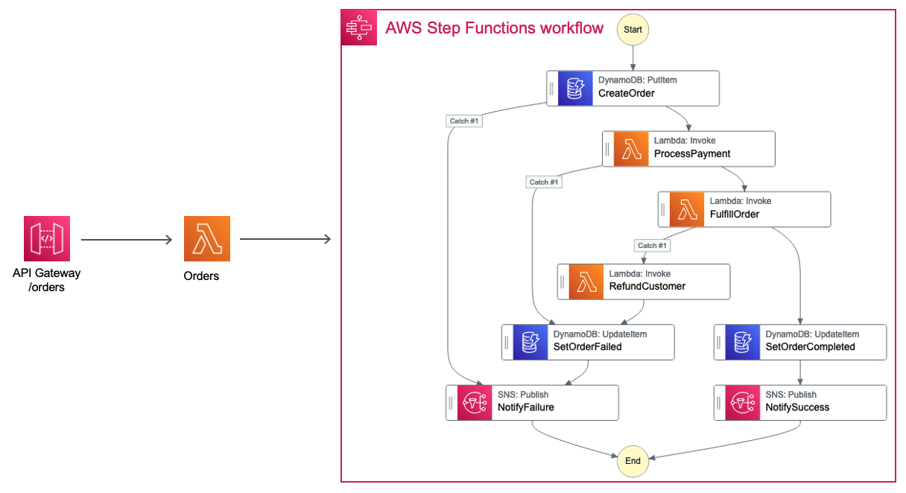
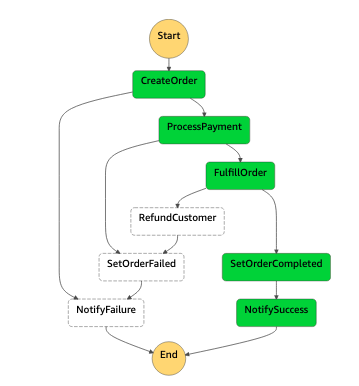
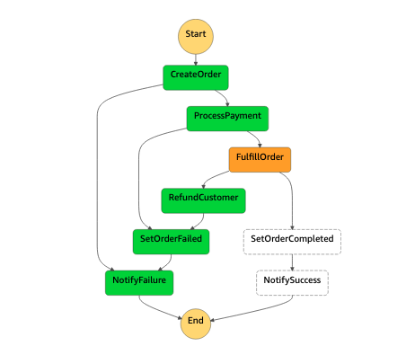
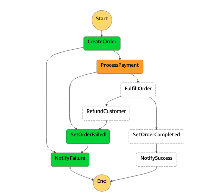
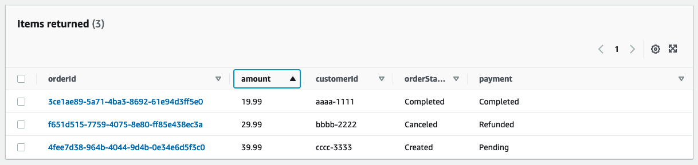

## SAGA-Pattern - AWS Serverless - Java

This is a Java implementation of the SAGA Pattern as described in the official AWS documentation
https://docs.aws.amazon.com/prescriptive-guidance/latest/modernization-data-persistence/saga-pattern.html



## Description

In this example the SAGA Pattern is implemented by AWS Step-Functions in order to maintain data consistency across multiple Microservices, 
and also offers compensation transactions in case of failure.

The SAM template contains all the information to deploy AWS resources and also the permission required by these service to communicate.

You will be able to create and delete the CloudFormation stack using AWS SAM.

This is fully functional example implemented in Java 11.

Important: this application uses various AWS services and there are costs associated with these services after the Free Tier usage - please see the AWS Pricing page for details. You are responsible for any AWS costs incurred.

## Language:
#### This is a Maven project which uses Java 11 and AWS SDK

## Framework
The framework used to deploy the infrastructure is SAM

## Services used

#### API Gateway - AWS Lambda - Step-Functions - DynamoDB - Amazon SNS

## Deployment commands
````
mvn clean package

aws s3 mb s3://pcvkcoidw9cf82938odw

aws s3 cp target/sourceCode.zip s3://pcvkcoidw9cf82938odw

sam deploy --s3-bucket pcvkcoidw9cf82938odw --stack-name saga-pattern --capabilities CAPABILITY_IAM
````

## TESTING
#### Subscribe to the SNS Topics to receive the confirmation email

#### use aws cli to show the SNS Topics
````
aws sns list-topics
````

#### subscribe to the SNS topics with your email address and confirm your subscription

````
aws sns subscribe \
--topic-arn arn:aws:sns:eu-central-1:YOUR_AWS_ACCOUNT:NotifyFailure \
--protocol email \
--notification-endpoint YOUR_EMAIL@DOMAIN.com

aws sns subscribe \
--topic-arn arn:aws:sns:eu-central-1:YOUR_AWS_ACCOUNT:NotifySuccess \
--protocol email \
--notification-endpoint YOUR_EMAIL@DOMAIN.com
````

 Copy the API Gateway URL for the Orders endpoint from the SAM deploy output
  i.e.
 Outputs
 -------------------------------------------------------------------------------------------------------------------------------------------------------------------------------------------------------------------------------------
 Key                 PaymentsEndpoint
 Description         API Gateway Orders Endpoint                                                                                                                                                                     
 Value               https://______________.amazonaws.com/prod/orders

 Call the API Gateway - Happy-Path
````
curl -X POST https://API_GATEWAY_URL -H "Content-Type: application/json" -d '{"customerId": "aaaa-1111","amount": "19.99"}'
````

 You should receive a confirmation email {"orderStatus":"Completed","payment":"Completed"}

 Step-Functions Happy-Path


 To simulate an STOCK UNAVAILABLE edit the class com.ibercode.fulfillment.FulfillOrder, comment/uncomment existing code and redeploy 
````
mvn clean package
sam deploy --s3-bucket pcvkcoidw9cf82938odw --stack-name saga-pattern --capabilities CAPABILITY_IAM
````

 Call the API Gateway 
````
curl -X POST https://API_GATEWAY_URL -H "Content-Type: application/json" -d '{"customerId": "bbbb-2222","amount": "29.99"}'
````

 You should receive a confirmation email {"OrderStatus":"Canceled","Payment":"Refunded"}

 Step-Functions STOCK UNAVAILABLE



To simulate a PAYMENT FAILURE edit the class com.ibercode.payment.PaymentProcess, comment/uncomment existing code and redeploy
````
mvn clean package
sam deploy --s3-bucket pcvkcoidw9cf82938odw --stack-name saga-pattern --capabilities CAPABILITY_IAM
````

 Call the API Gateway
````
curl -X POST https://API_GATEWAY_URL -H "Content-Type: application/json" -d '{"customerId": "cccc-3333","amount": "39.99"}'
````

 You should receive a confirmation email {"OrderStatus":"Created","Payment":"Pending"}


 Step-Functions PAYMENT FAILURE



 DynamoDB Transactions


 CLEAN-UP
````
aws cloudformation delete-stack --stack-name saga-pattern

aws s3 rm s3://pcvkcoidw9cf82938odw --recursive

aws s3 rb s3://pcvkcoidw9cf82938odw
````
## Requirements

* [Create an AWS account](https://portal.aws.amazon.com/gp/aws/developer/registration/index.html) if you do not already have one and log in. The IAM user that you use must have sufficient permissions to make necessary AWS service calls and manage AWS resources.
* [AWS CLI](https://docs.aws.amazon.com/cli/latest/userguide/install-cliv2.html) installed and configured
* [AWS Serverless Application Model](https://docs.aws.amazon.com/serverless-application-model/latest/developerguide/serverless-sam-cli-install.html) (AWS SAM) installed

## Author
Razvan Minciuna
https://www.linkedin.com/in/razvanminciuna/
